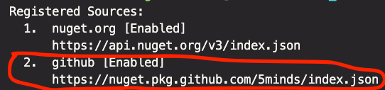

# BeginnersCourse.Template.Vorlage

Dieses Template dient dem Zweck das Erstellen eines Beispielprojektes zu vereinfachen.

## Wie wurde das Template umgesetzt?

Das Template ist ein .NET-Template, welches nach dem Standard der *[Template-Engine](https://github.com/dotnet/templating/wiki)* erstellt wurde.

Dafür wurde ein Ordner `.template.config` mit einer `template.json` angelegt.
In dieser `template.json` sind sämtliche notwendige Informationen, wie Author, Parameter, Post-Actions etc., für das Template definiert. *[Weitere Informationen](https://docs.microsoft.com/de-de/dotnet/core/tools/custom-templates#templatejson)*

Das Template ist schließlich als NuGet-Paket auf GitHub unter *[https://nuget.pkg.github.com/5minds/index.json](https://nuget.pkg.github.com/5minds/index.json)* gepushed worden.

Folgend werden Vorraussetzungen, Installation und Anwendung des Templates erläutert.

## Grundvorraussetzungen

### Docker

<https://www.docker.com/get-started>

### .NET 6.0

<https://dotnet.microsoft.com/en-us/download/dotnet/6.0>

## NuGet-Source hinzufügen

1. Generiere GitHub-PAT mit dem Recht Pakete lesen zu dürfen - *[Ausführliche Anleitung](documentation/github/set_up_github_credentials_for_github-packages.md#github-pat-generieren)*

2. Exportiere GitHub-PAT und zugehörigen GitHub-Username in der `.zshrc` als Umgebungsvariable - *[Ausführliche Anleitung](documentation/github/set_up_github_credentials_for_github-packages.md#authentifizierung-einrichten)*

3. Überprüfen, ob die notwendige NuGet-Source schon hinzugefügt wurde

    ```zsh
    dotnet nuget list source
    ```

    Wenn dort die Source `https://nuget.pkg.github.com/5minds/index.json` aufgelistet und als `[Enabled]` gekennzeichnet wird, kann zur Installation übergegangen werden.

    Wird die Source `https://nuget.pkg.github.com/5minds/index.json` aufgelistet, aber als `[Disabled]` gekennzeichnet, kann sie unter Angabe des spezifizierten Namens für diese Source wieder enabled werden.

    Lautet der spezifierte Name der Source `github` funktioniert das mit folgendem Befehl

    ```zsh
    dotnet nuget enable source github
    ```

4. NuGet-Source hinzufügen:

    ```zsh
    dotnet nuget add source --username ${GITHUB_USERNAME} --password ${GITHUB_PAT} --store-password-in-clear-text --name github "https://nuget.pkg.github.com/5minds/index.json"
    ```

    Der `--name` kann dabei frei gewählt werden.

    Prüfen, ob die Source hinzugefügt wurde:

    ```zsh
    dotnet nuget list source
    ```

    Folgender Output wird erwartet:

    

## Template installieren

1. Template installieren:

    ```zsh
    dotnet new -i BeginnersCourse.Template.Vorlage --nuget-source "https://nuget.pkg.github.com/5minds/index.json"
    ```

2. Prüfen, ob das Template richtig installiert wurde:

    ```zsh
    dotnet new beginnerscourse -h
    ```

## Template anwenden

1. In einen Ordner der Wahl navigieren, wo die Anwendung generiert werden soll.
2. Eine neue Anwendung generieren

    ```zsh
    dotnet new beginnerscourse -o "My.Cool.Tutorial"
    ```

    `My.Cool.Tutorial` ist hier der Beispielname des Projekts.

    Wenn Sie sich schon im Ordner befinden, in dem die Anwendung liegen soll, können Sie die `-o` Option durch die `-n` Option austauschen. Das verhindert, dass die Anwendung in einen Ordner gelegt wird, der zusätzlich im aktuellen Verzeichnis generiert wird.

3. Anwendung starten:

    Zu `My.Cool.Tutorial` navigieren.

    ```zsh
    make run
    ```

Standardmäßig ist das Portal dann unter <http://localhost:8082/> zu erreichen. Wenn Sie einen anderen Portal-Port angeben muss dieser im angegeben Link ausgetauscht werden.

Selbiges gilt für den Port der Engine. Standardmäßig ist die Engine unter <http://localhost:8000/> zu erreichen.
